# Narnix

A base template for Telegram bots on Cloudflare Workers: grammY for the Bot API, D1
for state, KV for sessions, Cron Triggers for background work. Clone it, delete the
parts you do not want, and add your own feature as one more module.

It exists because every bot ends up needing the same awkward pieces, and each one has
a sharp edge that costs a day to find. KV is eventually consistent, so it is the
wrong home for a wizard's replay log. A conversations-based wizard replays its
function from the top on every update, so a naive `Math.random()` fires twice. And a
broadcast loop cannot finish inside one invocation's 50-subrequest budget, no matter
how you size the batches. Those answers are already wired in here, and the comments
say why each one is the way it is.

**Getting started: [docs/setup.md](docs/setup.md)** — zero to a running bot in about
twenty minutes, including the two steps that fail quietly: forum topic mode in
@BotFather, and the placeholder ids in `wrangler.jsonc`.

## What's in the box

- **A module system.** A feature is a `BotModule`: an id, a grammY `Composer`, and
  optionally a list of wizards. Registered in one place, in an order that is
  documented and enforced. [docs/adding-a-module.md](docs/adding-a-module.md) walks
  through a whole feature.
- **i18n with typed keys.** English and Persian. The key set is a TypeScript union
  derived from `fa.json`, so a typo is a compile error rather than a raw key printed
  in someone's chat. Audited by `pnpm check:i18n` — see
  [docs/i18n.md](docs/i18n.md).
- **Wizards that survive a restart.** `@grammyjs/conversations` v2 over a D1 replay
  log (not KV — `src/core/conversationStorage.ts` explains why), a 30-minute idle
  timeout, and typed prompt helpers (`askText`, `askInt`, `askChoice`, `confirm`) in
  `src/core/wizard.ts`.
- **A ticket system on forum topics.** Each ticket is a thread in the user's private
  chat and a matching thread in the owner's, relayed both ways. Every relayed message
  is recorded, so a message sent while one side has minimized their thread is
  delivered when it reopens instead of being dropped. Needs topic mode enabled on
  the bot.
- **An admin panel.** User lookup with a balance lever, admin add and remove, and a
  broadcast composer — all of it behind a single `composer.filter(isAdmin)`.
- **Broadcasts that actually finish.** The wizard only queues a row. A cron trigger
  drains it 15 recipients at a time with a keyset cursor, leases the job so two
  overlapping invocations cannot deliver the same batch twice, and stamps users who
  blocked the bot so future sends skip them.
- **An enforced data layer.** SQL is prepared in exactly two kinds of place:
  `src/core/db/` and a module's own `repo.ts`. `pnpm check:layer` fails the build
  anywhere else.
- **A channel lock.** An optional membership gate that fails open by default,
  because a broken membership check should not take the whole bot offline.
- **Local development without a public URL.** `pnpm poll` runs the real bot in long
  polling mode against your local D1 and KV.

## Quick start

```bash
pnpm install
cp .dev.vars.example .dev.vars   # BOT_TOKEN from @BotFather, your user id as OWNER
pnpm db:migrate                  # the local D1; needs no Cloudflare credentials
pnpm poll                        # the bot, long polling — the normal dev loop
```

The rest — @BotFather's topic-mode toggle, the D1 and KV ids in `wrangler.jsonc`,
Worker secrets, the webhook — is in [docs/setup.md](docs/setup.md), in order.

## How it fits together

```text
src/
  index.ts        webhook (fetch) + cron (scheduled) entry points
  poll.ts         the long-polling entry point, for `pnpm poll`
  core/           bot assembly, module registry, wizard helpers, the data layer
    db/           model.ts (the typed repo() builder), models.ts, repositories/
  modules/        start · language · ticket · admin — one directory per feature
  jobs/           cron work: the broadcast drain
  middlewares/    the channel lock
  types/          env bindings, the context flavor, row types, the key union
  utils/          dates, randomness, formatting, KV sessions, the translator
  locales/        fa.json (source of truth) + en.json
scripts/          the audit harnesses: check.i18n, check.layer, smoke.wizards
migrations/       numbered .sql files, applied by wrangler
```



```mermaid
flowchart LR

subgraph external["External"]
  direction TB
  node_telegram_user(("Telegram User"))
  node_cron_trigger(("Cron Trigger"))
  node_telegram_api["Telegram API"]
end

subgraph group_runtime["Bot Runtime"]
  direction TB
  node_worker_entry["Worker Entry<br/>[index.ts]"]
  node_bot_assembly["Bot Assembly<br/>[bot.ts]"]
  node_module_registry["Module Registry<br/>[registry.ts]"]
  node_channel_gate["Channel Gate<br/>[channelLock.ts]"]
  node_error_handler["Error Handler<br/>[errorHandler.ts]"]
end

subgraph group_features["Bot Features"]
  direction TB
  node_start_module["Start Module<br/>[index.ts]"]
  node_language_module["Language Module<br/>[index.ts]"]
  node_ticket_module["Ticket Module<br/>[index.ts]"]
  node_admin_module["Admin Module<br/>[index.ts]"]
  node_wizard_runtime["Wizard Runtime<br/>[wizard.ts]"]
  node_i18n["Translation Service<br/>[i18n.ts]"]
end

subgraph group_persistence["State Layer"]
  direction TB
  node_db_repositories["Core Repositories"]
  node_ticket_repo["Ticket Repository<br/>[repo.ts]"]
  node_conversation_storage["Conversation Storage"]
  node_d1[("D1 Database")]
  node_kv_sessions[("KV Sessions<br/>[kvStorage.ts]")]
end

subgraph group_background["Background Work"]
  direction TB
  node_job_dispatcher["Job Dispatcher<br/>[index.ts]"]
  node_broadcast_drain["Broadcast Drain<br/>[broadcast.ts]"]
end


%% =========================
%% Runtime flow
%% =========================

node_telegram_user -->|"sends updates"| node_worker_entry
node_cron_trigger -->|"starts schedule"| node_worker_entry

node_worker_entry -->|"creates bot"| node_bot_assembly
node_bot_assembly -->|"loads modules"| node_module_registry
node_bot_assembly -->|"mounts middleware"| node_channel_gate

%% =========================
%% Module dispatch
%% =========================

node_module_registry -->|"dispatches routes"| node_start_module
node_module_registry -->|"dispatches routes"| node_language_module
node_module_registry -->|"dispatches routes"| node_ticket_module
node_module_registry -->|"dispatches routes"| node_admin_module

%% =========================
%% Feature dependencies
%% =========================

node_start_module -->|"upserts users"| node_db_repositories

node_language_module -->|"updates language"| node_db_repositories
node_language_module -->|"changes translator"| node_i18n

node_ticket_module -->|"reads tickets"| node_ticket_repo
node_ticket_module -->|"relays messages"| node_telegram_api

node_admin_module -->|"starts wizards"| node_wizard_runtime
node_admin_module -->|"manages records"| node_db_repositories

%% =========================
%% State
%% =========================

node_ticket_repo -->|"reads / writes"| node_d1
node_wizard_runtime -->|"replays state"| node_conversation_storage
node_conversation_storage -->|"stores logs"| node_d1

node_db_repositories -->|"reads / writes"| node_d1
node_bot_assembly -->|"stores sessions"| node_kv_sessions

%% =========================
%% Runtime support
%% =========================

node_error_handler -->|"stamps blocked users"| node_db_repositories

node_channel_gate -.->|"checks membership"| node_telegram_api

%% =========================
%% Telegram API
%% =========================

node_start_module -->|"renders menus"| node_telegram_api
node_language_module -->|"renders language"| node_telegram_api
node_admin_module -->|"renders controls"| node_telegram_api

%% =========================
%% Background jobs
%% =========================

node_worker_entry -->|"runs cron"| node_job_dispatcher
node_job_dispatcher -->|"dispatches drain"| node_broadcast_drain

node_broadcast_drain -->|"claims recipients"| node_d1
node_broadcast_drain -->|"sends batches"| node_telegram_api
node_broadcast_drain -->|"records reachability"| node_db_repositories


%% =========================
%% Source links
%% =========================

click node_worker_entry "src/index.ts"
click node_bot_assembly "src/core/bot.ts"
click node_module_registry "src/core/registry.ts"
click node_channel_gate "src/middlewares/channelLock.ts"
click node_error_handler "src/core/errorHandler.ts"

click node_start_module "src/modules/start/index.ts"
click node_language_module "src/modules/language/index.ts"
click node_ticket_module "src/modules/ticket/index.ts"
click node_admin_module "src/modules/admin/index.ts"
click node_wizard_runtime "src/core/wizard.ts"
click node_i18n "src/utils/i18n.ts"

click node_db_repositories "https://github.com/realsamy/narnix/tree/main/src/core/db/repositories"
click node_ticket_repo "src/modules/ticket/repo.ts"
click node_conversation_storage "src/core/conversationStorage.ts"
click node_kv_sessions "src/utils/kvStorage.ts"

click node_job_dispatcher "src/jobs/index.ts"
click node_broadcast_drain "src/jobs/broadcast.ts"


%% =========================
%% Styling
%% =========================

classDef toneNeutral fill:#f8fafc,stroke:#334155,stroke-width:1.5px,color:#0f172a
classDef toneBlue fill:#dbeafe,stroke:#2563eb,stroke-width:1.5px,color:#172554
classDef toneAmber fill:#fef3c7,stroke:#d97706,stroke-width:1.5px,color:#78350f
classDef toneMint fill:#dcfce7,stroke:#16a34a,stroke-width:1.5px,color:#14532d
classDef toneRose fill:#ffe4e6,stroke:#e11d48,stroke-width:1.5px,color:#881337
classDef toneIndigo fill:#e0e7ff,stroke:#4f46e5,stroke-width:1.5px,color:#312e81
classDef toneTeal fill:#ccfbf1,stroke:#0f766e,stroke-width:1.5px,color:#134e4a

class node_worker_entry,node_bot_assembly,node_module_registry,node_channel_gate,node_error_handler,node_telegram_user toneBlue
class node_start_module,node_language_module,node_ticket_module,node_admin_module,node_wizard_runtime,node_i18n toneAmber
class node_d1,node_db_repositories,node_ticket_repo,node_conversation_storage,node_kv_sessions,node_telegram_api toneMint
class node_job_dispatcher,node_broadcast_drain toneRose
class node_cron_trigger toneIndigo
```

There are two entry points. `fetch` answers Telegram's webhook POSTs, and any other
method gets a plain 200 that doubles as a health check. `scheduled` dispatches cron
triggers, branching on the literal expression string from `wrangler.jsonc` — add a
job by adding its expression there and a branch in `src/jobs/index.ts`, copying the
string exactly.

A module is a plain object, and registration order is middleware order:

```ts
export const NotesModule: BotModule = {
  id: "notes",              // unique; the registry throws on a collision
  name: "Personal Notes",
  composer,                 // the module's routes and handlers
  conversations: [noteAdd], // multi-step forms it owns
};
```

`StartModule` registers first, because it owns `/start`, which upserts the user row
every other module reads. `AdminModule` registers last: its filtered composer claims
broad callback patterns and would shadow feature-module handlers, but only for
accounts that happen to be admins — the hardest class of bug to notice, because it
only reproduces on your own account. Your modules go in between.

The data layer has one rule: **SQL statements are prepared only inside
`src/core/db/` or a module's own `repo.ts`.** Everything else calls named functions
(`redeemReferral`, `listReachableIdsAfter`) that take `db` first and read like what
they mean. The generic `repo()` builder compiles each helper to exactly one prepared
statement — no joins, no runtime SQL parsing — and its where-language covers the
three predicate shapes this bot actually needs: equality, `IS NULL`, and `IN`.
Anything richer belongs in a repository function, not in a fourth value shape.

## The gates

```bash
pnpm typecheck       # tsc --noEmit over src/, scripts/ and the tests
pnpm check:i18n      # the locale audit
pnpm check:layer     # fails if SQL is prepared outside the data layer
pnpm test            # vitest unit tests
pnpm smoke:wizards   # drives every wizard against the local D1
```

That is the whole CI job (`.github/workflows/ci.yml`). Run them before pushing. None
of them need Cloudflare credentials; `smoke:wizards` wants `pnpm db:migrate` first.

## Decide before you ship

A few things the base keeps on purpose, where the call is yours:

- **The referral payout is off by default.** Sharing an invite link still records
  the inviter, but the balance credit sits behind `CREDIT_REFERRAL_BONUS` in
  `src/modules/start/utils.ts` — one constant to flip if your bot has a wallet.
- **The wallet itself.** A `balance` column, `creditBalance`/`debitBalance`, and the
  admin panel's lever. Useful if you sell anything; delete the lever if you do not.
- **Toman is the currency.** `toman()` and `money()` in `src/utils/format.ts` read
  the `common.toman` locale key, and hold no currency string of their own. Changing
  currency means editing that key in both locale files.
- **Persian is the fallback language.** A Telegram client language the bot does not
  ship copy for lands on `fa`, and `en.json` is allowed to be partial. Flip the
  precedence in `src/utils/i18n.ts` if your bot is English-first.
- **Tickets need topic mode** enabled for the bot in @BotFather. Without it the flow
  degrades with a clear message rather than breaking — which also makes it easy to
  miss that the feature is off.

## Using this as a template

Click **Use this template**, or `gh repo create my-bot --template realSamy/narnix`,
then work through [docs/setup.md](docs/setup.md).

Nothing operator-specific is committed. There is no `vars` block in
`wrangler.jsonc`; the bot token, owner id and channel lock come from `.dev.vars`
locally and Worker secrets in production, and the two ids in `wrangler.jsonc` are
placeholders you replace with your own. Removing a module means deleting its
`register()` call, its directory and its locale keys — `pnpm check:i18n` lists the
orphans it leaves behind.

MIT — see [LICENSE](LICENSE).

